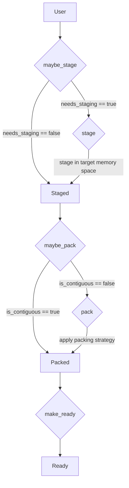

# View Preparation Design

## 1. Introduction

Kokkos Comm communication primitives operate on user-provided Kokkos Views, but backend communication APIs do not always support those Views directly.
A View may reside in a memory space inaccessible to the selected backend, may use a non-contiguous layout, or may require a backend-specific datatype representation before it can be passed to MPI, NCCL, RCCL, or another communication transport.

Today, this preparation logic is implemented locally inside backend bindings and communication primitives.
Each primitive must decide whether staging is required, whether packing is required, which temporary objects must be kept alive, how backend arguments are formed, and which callbacks must run after completion.
This duplicates the same control flow across backends and operations, making the implementation verbose and difficult to audit.

This document specifies an internal View-preparation API that factors this logic into a compile-time state machine.
The API converts a user View into a `ReadyView`: a lightweight backend-facing descriptor containing a communication pointer, logical element count, and backend datatype.
The preparation path has a fixed order: staging, then packing.
Transformations may allocate temporary Views, enqueue data movement, and register completion callbacks on the associated `Request`, but they must not fence.

The goal is to make backend primitive implementations uniform:

```cpp
auto ready = Impl::prepare<Impl::ViewAccess::Read>(exec, view, req);

comm_primitive(
  ready.data(),
  ready.count(),
  ready.datatype() /*, ... */
);
```

This API is an internal implementation detail. It is intended for Kokkos Comm implementers, not end users, and exists to make communication preparation simpler, more robust, and easier to reason about.

## 2. Motivation

### 2.1 Background

Kokkos Comm aims to provide communication primitives that operate directly on Kokkos Views while targeting multiple backend communication libraries.
This requires the implementation to bridge two sets of constraints: the properties of the user-provided View, and the requirements of the selected communication backend.

The relevant View properties are its memory space accessibility from the execution space used to enqueue communication preparation, layout contiguity, logical element count, and value type.
A View may already be directly communicable, or it may require an intermediate representation before it can be passed to the backend.

Backend constraints differ: MPI may or may not be able to communicate device memory, depending on whether GPU-aware support is available in the user-provided MPI implementation; NCCL and RCCL require buffers in device-accessible memory.
Backends also expose different datatype systems: a type that is directly representable in MPI may not be directly representable in NCCL/RCCL, and a non-contiguous View may require either physical packing or a backend-specific datatype representation.

### 2.2 Issues with the current design

The current implementation handles these cases inside backend bindings and communication primitives.
A representative example where a View is both read and written (e.g, Broadcast, in-place All-Gather, etc.) may look like this:

```cpp
template <CommunicationSpace C, KokkosExecutionSpace E, MutKokkosView V>
auto comm(Communicator<C, E>& comm, const E& exec, const V& view) -> kc::Request<C> {
  // assert preconditions...

  Request<C> req;
  if constexpr (Impl::needs_staging<C, E, V>) {
    auto staged_view = Impl::stage_to<typename C::preferred_memory_space>(exec, view);
    req.extend_view_lifetime(staged_view);
    if (!is_contiguous(staged_view)) {
      auto packed_staged_view = Impl::pack_for(exec, staged_view);
      req.extend_view_lifetime(packed_staged_view);
      comm_primitive(
        packed_staged_view.data,
        packed_staged_view.count,
        packed_staged_view.datatype,
        /* ... */
      );
      req.add_callback([exec, packed_staged_view, staged_view, view]() {
        Impl::unpack(exec, staged_view, packed_staged_view);
        Impl::unstage(exec, view, staged_view);
      });
    } else {
      comm_primitive(
        data_handle(staged_view),
        span(staged_view),
        datatype_for<C>(staged_view),
        /* ... */
      );
      req.add_callback([exec, staged_view, view]() {
        Impl::unstage(exec, view, staged_view);
      });
    }
  } else {
    if (!is_contiguous(view)) {
      auto packed_view = Impl::pack_for(exec, view);
      req.extend_view_lifetime(packed_view);
      comm_primitive(
        packed_view.data,
        packed_view.count,
        packed_view.datatype,
        /* ... */
      );
      req.add_callback([exec, packed_view, view]() {
        Impl::unpack(exec, view, packed_view);
      });
    } else {
      comm_primitive(
        data_handle(view),
        span(view),
        datatype_for<C>(view),
        /* ... */
      );
    }
  }

  // assert postconditions...
  return req;
}
```

This structure has several problems:

1. It mixes decision logic, data movement, lifetime extension, backend argument construction, backend invocation, and completion-time restoration in the same local control flow.
2. It creates multiple call sites for the same backend primitive, with different arguments depending on whether the backend receives the original View, a staged View, or a packed representation.
3. It forces code duplication across backends and primitive implementations that is independent of both.

As more primitives and backends are added, the same logic will again need to be replicated with small local variations.
The invariants remain the same, but every implementation must restate them: determine staging, determine packing, keep temporaries alive, call the backend with the correct descriptor, and restore the user View when required.
This makes the implementation larger, harder to reason about, and more prone to get subtly wrong.

The proposed compile-time state machine API centralizes this preparation logic.
Backend primitives should receive a uniform `ReadyView` descriptor regardless of how that descriptor was produced.
The backend call site should not need to know whether the View was used directly, staged, packed, or both.
The behavior of staging and packing operations may be tuned locally, or at the backend level, via traits specialization or configure-time user selection.
The interface presented in this document should compile away entirely and incur no overhead compared to the existing implementation.
It should also allow some local optimizations, such as combining staging and packing operations, while still maintaining the state machine semantics.

### 2.2 Control plane vs. data plane

The proposed design separates View preparation into control-plane and data-plane responsibilities.

The control plane inspects the View and backend properties, selects the required transformations, constructs the corresponding state-machine path, allocates any required temporary storage, and registers its lifetime extension and any required completion actions on the `Request`.
In this design, `prepare` is the main control-plane operation.

The data plane performs the transformations selected by the control plane.
Staging consumes an already-allocated destination View and enqueues a copy operation into a backend-accessible memory space.
Packing consumes an already-allocated destination View when using a physical packing strategy (such as `DeepCopy`), or constructs a backend-specific representation when using a representational strategy (such as `DerivedMpiDatatype`).

Allocation is therefore not owned by the `stage` or `pack` functions: they operate directly on storage or representations selected by the control plane.
This keeps allocation policy separate from data movement, and leaves room for future allocation sources such as user-provided scratch buffers or Kokkos Comm-managed memory pools, without changing the semantics of the data-transforming transitions.

Data-transforming operations may register inverse completion callbacks when the access mode requires copying data back into the original View.
For example, a `ReadWrite` staging operation may register a callback that copies the staged View back into the user View after communication completion.
Because transformations are applied in preparation order, completion callbacks must execute in reverse registration order.

No preparation operation may fence: all data allocation and movement must be enqueued on the provided execution space, and all restoration must be sequenced through `Request` completion callbacks.
This preserves the asynchronous execution model and allows blocking operations to be expressed as nonblocking operations followed by an immediate wait.

## 3. Goals & Non-goals

The goal of this design is to make View preparation a single internal mechanism that backend communication primitives can reuse.

This design must provide:

* a uniform conversion from a user-provided View to a backend-facing communication-ready View;
* a single place to decide and perform the preparation required by memory accessibility, layout, datatype, and access mode;
* explicit Read, Write, and Read-Write semantics for prepare-time and completion-time data movement;
* correct lifetime and completion handling for temporary state owned by an outstanding communication operation;
* asynchronous execution, with preparation and completion work ordered through the associated execution space and `Request`;
* a backend call site that consumes only the prepared descriptor, independent of how preparation was satisfied;
* well-defined rejection of unsupported View, backend, datatype, and access-mode combinations.

This design does not:

* define a user-facing API;
* introduce new communication primitives or change the public semantics of existing primitives;
* make user Views safe to access while communication using them is still outstanding;
* define operation-specific datatype validity for every backend primitive.

## 4. Existing concepts and interfaces

### 4.1 `CommunicationSpace`

A `CommunicationSpace` represents which communication backend performs the communication operation.

Currently supported `CommunicationSpace`s in Kokkos Comm:

| Communication space | C++ type                              |
| ------------------- | ------------------------------------- |
| MPI                 | `KokkosComm::MpiSpace`                |
| NCCL                | `KokkosComm::Experimental::NcclSpace` |

### 4.2 `ExecutionSpace`

An `ExecutionSpace` is a Kokkos-provided concept representing "where" and "how" execution takes place.

Currently supported `ExecutionSpace`s in Kokkos:

| Execution space | C++ type                             |
| --------------- | ------------------------------------ |
| Serial          | `Kokkos::Serial`                     |
| OpenMP          | `Kokkos::OpenMP`                     |
| C++ threads     | `Kokkos::Threads`                    |
| CUDA            | `Kokkos::Cuda`                       |
| HIP             | `Kokkos::HIP`                        |
| SYCL            | `Kokkos::SYCL`                       |
| HPX             | `Kokkos::Experimental::HPX`          |
| NextSilicon     | `Kokkos::Experimental::NextSilicon`  |


### 4.3 `MemorySpace`

An `MemorySpace` is a Kokkos-provided concept representing "where" and "how" memory allocation and access take place.

Currently supported `MemorySpace`s in Kokkos:

| Memory space                     | C++ type                        |
| -------------------------------- | ------------------------------- |
| Host memory                      | `Kokkos::HostSpace`             |
| Shared host/device memory        | `Kokkos::SharedSpace`           |
| Shared host/device pinned memory | `Kokkos::SharedHostPinnedSpace` |
| CUDA device memory               | `Kokkos::CudaSpace`             |
| CUDA host-pinned memory          | `Kokkos::CudaHostPinnedSpace`   |
| CUDA unified virtual memory      | `Kokkos::CudaUVMSpace`          |
| HIP device memory                | `Kokkos::HIPSpace`              |
| HIP host-pinned memory           | `Kokkos::HIPHostPinnedSpace`    |
| HIP managed memory               | `Kokkos::HIPManagedSpace`       |
| SYCL device USM memory           | `Kokkos::SYCLDeviceUSMSpace`    |
| SYCL host USM memory             | `Kokkos::SYCLHostUSMSpace`      |
| SYCL shared USM memory           | `Kokkos::SYCLSharedUSMSpace`    |


### 4.4 `KokkosView` and `MutKokkosView` 

The `KokkosView` and `MutKokkosView` concepts model Kokkos View-like object.
This includes both Views and subviews, and allows Kokkos Comm to enforce stricter type checking at compile time.
Contrarily to `KokkosView`, which may have a constant value type, `MutKokkosView` ensures the View is mutable so that Kokkos Comm operations can safely write to it.

### 4.5 `Request` object

A `Request` is a lightweight handle for asynchronous completion.
It is specialized for every `CommunicationSpace` to provide backend-specific completion mechanism that is consistent with the Kokkos Comm model.

### 4.6 Backend datatype conversion

Kokkos Comm provides public utility functions that convert C++-native datatypes into their communication space representation (respectively `MPI_Datatype` for `MpiSpace`, and `ncclDataType_t` for `NcclSpace`).

```cpp
template <CommunicationSpace C, typename T>
[[nodiscard]] constexpr auto datatype() -> typename C::datatype_type;

template <CommunicationSpace C, KokkosView V>
[[nodiscard]] constexpr auto datatype_for(const V&) -> typename C::datatype_type;

template <CommunicationSpace C, KokkosView V>
[[nodiscard]] constexpr auto datatype_for(const C&, const V&) -> typename C::datatype_type;
```

### 4.7 Backend communication primitives

As of writing, Kokkos Comm defines 7 communication primitives: 2 point-to-point (P2P) operations, and 5 collective (Coll) operations.

| Primitive      | Kind | C++ function |
| -------------- | ---- | ------------ |
| Send           | P2P  | `send`       |
| Receive        | P2P  | `recv`       |
| Broadcast      | Coll | `broadcast`  |
| Reduce         | Coll | `reduce`     |
| All-Reduce     | Coll | `allreduce`  |
| All-Gather     | Coll | `allgather`  |
| All-to-All     | Coll | `alltoall`   |

## 5. Terminology

### 5.1 User View

A User View is the original Kokkos View supplied by the user to a communication primitive.

It represents the user-visible source or destination of the communication operation.
Depending on the selected backend, memory space, layout, and datatype, a User View may or may not be directly communicable.

A User View is the first stage of the preparation state machine, and Kokkos Comm automatically extends its lifetime through the associated `Request`.
However, the user remains responsible for ensuring this User View is not reused until the communication completes.

### 5.2 Staged View

A Staged View is a View allocated in a memory space that is accessible to the selected Communication Space.

Staging is required when the Communication Space cannot directly access the Memory Space of the User View.
For example, a non-GPU-aware MPI installation may require staging a device-stored View into host-accessible memory, while NCCL/RCCL may require staging a host-stored View into device-accessible memory.

A Staged View is produces only when the `needs_staging<Comm, View>` and `allows_staging<Comm, View>` traits are true.
It is temporary state; its lifetime is extended through the associated `Request` when it is required for an outstanding communication operation.

### 5.3 Packed View

A Packed View is a communication-ready representation of a non-contiguous View produced by a packing strategy.

For physical packing strategies, the Packed View is a contiguous View.
For representational strategies, the Packed View may instead be a descriptor that represents the original non-contiguous layout using a communication space-specific datatype.

A Packed View is produced only when the `is_contiguous(view)` is false.
It is temporary state; its lifetime is extended through the associated `Request` when it is required for an outstanding communication operation.

### 5.4 Ready View

A Ready View is the backend-facing object providing the required View metadata to communication primitives after View preparation.

A Ready View must provide:

* a pointer to the underlying data;
* a logical element count;
* a Communication Space-specific datatype.

A Ready View may refer directly to the original User View when no staging or packing is required. Otherwise, it refers to temporary state produced by staging, packing, or both. Any temporary state referenced by a Ready View must be kept alive through the associated `Request`.

Only a Ready View may provide the metadata accessors to backend communication calls.

### 5.5 View Access

View Access describes how a communication operation accesses the user View.

The defined access kinds are:

| View Access kind | Preparation behavior                                    | Completion behavior                      |
| ---------------- | ------------------------------------------------------- | ----------------------------------------- |
| Read             | allocate destination and copy the User View into it     | no copy back                             |
| Write            | allocate destination without copying from the User View | copy destination back into the User View |
| Read-Write       | allocate destination and copy the  User View into it    | copy destination back into the User View |

Read-Write is equivalent to Read semantics during preparation and Write semantics during completion.

### 5.6 Packing Strategy

A Packing Strategy defines how View preparation represents a non-contiguous View for backend communication.

A strategy may be either physical, i.e., pack non-contiguous data into a contiguous temporary View; or representational, i.e., it may construct a backend-specific representation of the original View layout.
Packing strategies are internal implementation policies selected at compile-time.
They are applied only when `needs_packing<V>` is true.

## 6. Design overview

View preparation is modeled as a fixed-order state machine.
Each state represents what Kokkos Comm knows about the current communication representation of the user View.
The state machine always evaluates staging before packing, then converts the packed state into the backend-facing ready state.



The `maybe_stage`, `maybe_pack` steps are unconditional parts of the pipeline.
They decide whether an actual data transformation is needed, but they always produce the next state.
If staging is not required, `maybe_stage` produces a Staged state whose active View is the original user View.
If staging is required, `maybe_stage` invokes `stage` to create a backend-accessible temporary View, and the Staged state makes that temporary View active.

Similarly, if the active View is contiguous, `maybe_pack` produces a Packed state that describes the active View directly.
If the active View is non-contiguous, `maybe_pack` invokes `pack` to apply the selected Packing Strategy, and the Packed state describes the resulting communicable representation.
The final `make_ready` transition exposes only the backend-facing metadata of the communication-ready View.

This gives every backend primitive the same final shape: prepare the View, then pass only the ready state's pointer, count, and datatype to the backend.

Only the Ready state may expose backend-facing communication metadata.
The earlier states are preparation states: they may own, borrow, or describe intermediate storage, but backend primitives must not consume them directly.

### 6.1 User to Staged state

The User state wraps the original user-provided View.
It is the source of truth for completion-time restoration and for direct communication when no intermediate storage is needed.
View preparation extends the user View lifetime through the associated `Request`, but the user remains responsible for not accessing the View while an operation using it is outstanding.

The `maybe_stage` transition decides whether the selected communication backend can access the user View's memory space directly.
When `needs_staging` is false, no temporary View is created and the Staged state identifies the user View as the active View.
When `needs_staging` is true, `stage` creates a temporary View in the target memory space and the Staged state makes that temporary View active.

View Access determines whether `stage` initializes the temporary View:

| View Access | Prepare-time staging behavior          | Completion-time staging behavior                |
| ----------- | -------------------------------------- | ----------------------------------------------- |
| Read        | copy from the user View into staging   | no copy back                                    |
| Write       | do not copy from the user View         | copy staged data back into the user View        |
| Read-Write  | copy from the user View into staging   | copy staged data back into the user View        |

Staging is therefore both a memory-accessibility transition and part of the access-mode semantics.
For write-like access, the staged View is an intermediate destination whose final contents must be restored to the user View after backend communication completes.

### 6.2 Staged to Packed state

The `maybe_pack` transition operates on the active View from the Staged state.
The active View is either the original user View or the temporary staged View.

Packing is required when the active View is not contiguous and cannot be communicated as a single backend buffer.
If the active View is contiguous, no packed representation is created; the Packed state records the active View's data handle, logical count, and backend datatype directly.
If the active View is non-contiguous, `pack` applies the selected Packing Strategy to produce a communicable representation and updates the backend-facing count and datatype accordingly.

A Packing Strategy may satisfy this transition in different ways:

* A physical strategy materializes contiguous temporary storage and copies data between the active View and that storage.
* A representational strategy describes the non-contiguous layout using a backend-specific datatype or descriptor.

View Access determines whether `pack` moves data during preparation and whether it must restore data during completion:

| View Access | Prepare-time packing behavior          | Completion-time packing behavior                |
| ----------- | -------------------------------------- | ----------------------------------------------- |
| Read        | pack active View data when needed      | no unpack                                       |
| Write       | do not pack active View data           | unpack communicated data when packing was used  |
| Read-Write  | pack active View data when needed      | unpack communicated data when packing was used  |

When both packing and staging are used for a write-like operation, completion restores data in reverse logical order: first unpack into the staged View, then unstage into the original user View.

### 6.3 Packed state to Ready View

The `make_ready` transition converts the Packed state into the Ready state.
This transition does not perform another data transformation.
It restricts the backend-facing interface to the metadata needed by communication primitives:

* a communication buffer pointer or handle;
* a logical element count;
* a communication-space datatype.

The Ready state may refer to the original user View, a staged View, a packed temporary View, or a backend-specific packed representation.
Any temporary state referenced by the Ready state must remain alive until the associated communication operation completes.
That lifetime is owned through the associated `Request`.

Backend primitives should therefore have one communication call site per operation shape.
They prepare each user View once, consume the resulting Ready state metadata, and remain independent of whether preparation used staging, packing, both, or neither.

## 7. Control-plane

The control-plane encode the decisions required to select a preparation path.
It is responsible for allocating required temporary Views, construct backend resources with runtime lifetime, and register callbacks.
They only describe what must happen.

The core traits are:

| Trait                            | Purpose                                                                                |
| -------------------------------- | -------------------------------------------------------------------------------------- |
| `needs_staging<C, E, V>`         | Whether `V` must be staged before communication through `C` using execution space `E`. |
| `needs_packing<V>`               | Whether `V` is non-contiguous and must be handled by a packing strategy.               |
| `default_packing_strategy<C, V>` | Which strategy is used to make non-contiguous `V` communicable through `C`.            |

These traits are consumed by `prepare` to construct the compile-time state-machine path.

### 7.1 `needs_staging<C, E, V>`

`needs_staging<C, E, V>` determines whether a View must be moved to a backend-accessible memory space before it can be passed to the selected communication backend.

It is true when `CommunicationSpace` `C` cannot directly communicate a View `V` prepared from execution space `E`.

Conceptually:

```cpp
template <CommunicationSpace C, KokkosExecutionSpace E, KokkosView V>
inline constexpr bool needs_staging =
  !is_backend_accessible<C, E, V>;
```

For MPI, this may depend on whether the MPI implementation is considered GPU-aware by Kokkos Comm configuration. For NCCL/RCCL, this generally means the View must be accessible from the device associated with the communication backend.

When `needs_staging<C, E, V>` is true, `prepare` must allocate a destination View in the staging memory space selected for `C`, `E`, and `V`, then invoke `stage` to produce a `StagedView`.

### 7.2 `needs_packing<V>`

`needs_packing<V>` determines whether a View is non-contiguous.

If `needs_packing<V>` is true, the View cannot be communicated as-is and must be handled by a `PackingStrategy`.

Conceptually:

```cpp
template <KokkosView V>
inline constexpr bool needs_packing =
  !is_contiguous<V>;
```

`needs_packing<V>` is independent of the selected backend. Backend-specific behavior is expressed by the selected packing strategy, not by the contiguity predicate itself.

For example:

* `DeepCopy` physically materializes a contiguous representation;
* `DerivedMpiDatatype` represents the non-contiguous layout using an MPI derived datatype.

Both strategies satisfy the same requirement: make a non-contiguous View communicable.

### 7.3 `default_packing_strategy<C, V>`

`default_packing_strategy<C, V>` selects the packing strategy used when `needs_packing<V>` is true.

The default strategy is `DeepCopy`. This strategy is backend-agnostic and materializes a contiguous Kokkos View.

MPI may optionally select `DerivedMpiDatatype` when that feature is enabled by configuration. This strategy is MPI-specific and represents the non-contiguous View using an MPI derived datatype rather than physically packing the data.

Conceptually:

```cpp
template <CommunicationSpace C, KokkosView V>
using default_packing_strategy =
  typename packing_traits<C, V>::default_strategy;
```

The selected strategy must be valid for the communication space.
For example, `DerivedMpiDatatype` must not be selected for NCCL or RCCL.

If no valid packing strategy exists for a non-contiguous View/backend combination, the program should fail at compile time where practical.


## 11. Data-plane functions

### 11.1 `stage`

### 11.2 `pack`

## 12. Packing strategies

### 12.1 `DeepCopy`

`DeepCopy` is the default, Communication Space-agnostic packing strategy.
It physically materializes a contiguous View from non-contiguous user Views.

### 12.2 `DerivedMpiDatatype`

`DerivedMpiDatatype` is MPI-specific and represents non-contiguous Views using an MPI derived datatype instead of physically packing the data.

Users may set `DerivedMpiDatatype` as the default strategy for MPI-based communications by enabling the `KokkosComm_ENABLE_MPI_DERIVED_DATATYPE_PACKING` CMake option at configure-time.

## 15. Error handling

### 15.1 Compile-time errors

### 15.2 Runtime errors

## 16. Performance considerations
